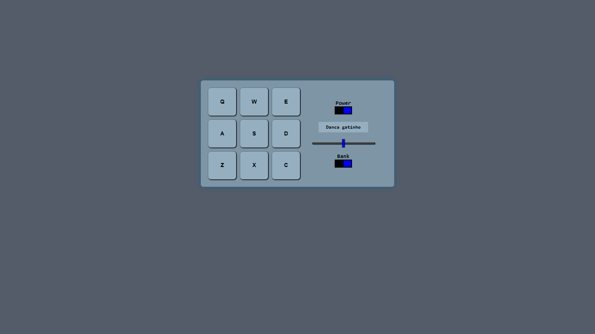

<h1 align="center">
   React Drum (Soundpad)
</h1>

## 
 <u>Preview da página:</u> 

  

> A página possui um front end interativo que permite criar e alterar tarefas"

<h4 align="center"><a href="https://tahaluh.github.io/drum-react/" target="_blank">Clique para visitar o projeto</a></h4>

---
# 💼 Tecnologias Utilizadas

As seguintes ferramentas foram usadas na construção do projeto:

- Html
- Css
- ReactJS

*Também foram aplicados conceitos de responsividade*

# ⚙️ Instalação

### Client

  1. `$ cd client`
  2. `$ npm install`
  3. `$ npm start`
  
# 🛠️ Funcionalidades

- Tocar sons previamente estabelecidos
- Alterar entre dois banco de sons
- Alterar volume dos áudios

---

Feito por Thauã Magalhães 👋🏽 Entre em contato!

 

